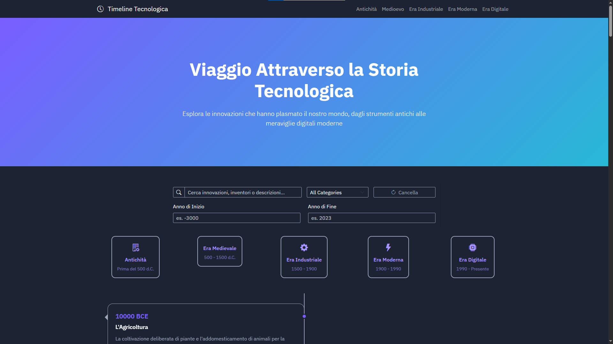

# 📚 TechTimeline – Viaggio Interattivo nella Storia della Tecnologia

TechTimeline è un progetto educativo e divulgativo che consente di esplorare i principali eventi e innovazioni che hanno segnato la storia dell’informatica e della tecnologia.  
Attraverso una linea del tempo interattiva sviluppata in HTML, CSS e JavaScript, l’utente può conoscere le tappe fondamentali dell’evoluzione digitale, dal primo computer alla nascita dell’Intelligenza Artificiale.

## 🎯 Obiettivi

- Promuovere la conoscenza storica della tecnologia in modo semplice e visivo
- Sviluppare competenze di frontend (HTML, CSS, JS)
- Unire passione per l’informatica e interesse per la storia
- Fornire uno strumento didattico accessibile a studenti e insegnanti

## 🛠️ Tecnologie utilizzate

- HTML5
- CSS3 (layout responsivo)
- JavaScript Vanilla (eventi, DOM dinamico)
- Replit come ambiente di sviluppo

## 📌 Funzionalità principali

- ✅ Timeline cronologica navigabile
- ✅ Eventi storici interattivi con descrizione sintetica
- ✅ Interfaccia responsive e minimale
- ✅ Facilmente estendibile con nuovi eventi

## 🧠 Competenze acquisite

- Strutturazione del DOM e uso di eventi JS
- Separazione tra contenuti e presentazione
- Sintesi e visualizzazione cronologica di informazioni complesse
- Uso consapevole di AI (ChatGPT, Copilot) per supporto tecnico e creativo

## 📷 Anteprima

 

## 🚀 Avvio del progetto

1. Scarica o clona il repository
2. Apri `index.html` in un browser moderno
3. Esplora la timeline e i suoi eventi!

## 🔗 Link utili

- [Progetto su Replit](https://replit.com/@federicopezze/TechTimeline)
- [Guida alla storia dell’informatica (Wikipedia)](https://it.wikipedia.org/wiki/Storia_dell%27informatica)

## 📄 Licenza

Distribuito con licenza **MIT**. Può essere riutilizzato e modificato per scopi educativi.

---

> 👨‍💻 Creato da Federico Pezzella – Studente ITIS, classe 4ª Informatica
